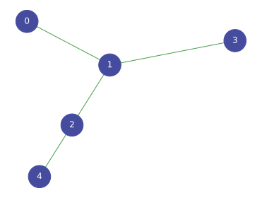

<!--
<p align="center">
  
</p>
-->

<h1 align="center">
  torch-ppr
</h1>

<p align="center">
    <a href="https://github.com/mberr/torch-ppr/actions?query=workflow%3ATests">
        
    </a>
    <a href="https://pypi.org/project/torch_ppr">
        
    </a>
    <a href="https://pypi.org/project/torch_ppr">
        
    </a>
    <a href="https://github.com/mberr/torch-ppr/blob/main/LICENSE">
        
    </a>
    <a href='https://torch_ppr.readthedocs.io/en/latest/?badge=latest'>
        
    </a>
    <a href="https://codecov.io/gh/mberr/torch-ppr/branch/main">
        
    </a>  
    <a href="https://github.com/cthoyt/cookiecutter-python-package">
         
    </a>
    <a href='https://github.com/psf/black'>
        
    </a>
    <a href="https://github.com/mberr/torch-ppr/blob/main/.github/CODE_OF_CONDUCT.md">
        
    </a>
</p>

This package allows calculating page-rank and personalized page-rank via power iteration with PyTorch,
which also supports calculation on GPU (or other accelerators).

## 💪 Getting Started

As a simple example, consider this simple graph with five nodes.
<p align="center">
  
</p>

Its edge list is given as
```python-console
>>> import torch
>>> edge_index = torch.as_tensor(data=[(0, 1), (1, 2), (1, 3), (2, 4)]).t()
```

We can use
```python-console
>>> from torch_ppr import page_rank
>>> page_rank(edge_index=edge_index)
tensor([0.1269, 0.3694, 0.2486, 0.1269, 0.1281])
```
to calculate the page rank, i.e., a measure of global importance.
We notice that the central node receives the largest importance score,
while all other nodes have lower importance. Moreover, the two
indistinguishable nodes `0` and `3` receive the same page rank.

We can also calculate *personalized* page rank which measures importance
from the perspective of a single node.
For instance, for node `2`, we have
```python-console
>>> from torch_ppr import personalized_page_rank
>>> personalized_page_rank(edge_index=edge_index, indices=[2])
tensor([[0.1103, 0.3484, 0.2922, 0.1103, 0.1388]])
```
Thus, the most important node is the central node `1`, nodes `0` and `3` receive
the same importance value which is below the value of the direct neighbor `4`.

By the virtue of using PyTorch, the code seamlessly works on GPUs, too, and
supports auto-grad differentiation. Moreover, the calculation of personalized
page rank supports automatic batch size optimization via
[`torch_max_mem`](https://github.com/mberr/torch-max-mem).

## 🚀 Installation

The most recent release can be installed from
[PyPI](https://pypi.org/project/torch_ppr/) with:

```bash
$ pip install torch_ppr
```

The most recent code and data can be installed directly from GitHub with:

```bash
$ pip install git+https://github.com/mberr/torch-ppr.git
```

## 👐 Contributing

Contributions, whether filing an issue, making a pull request, or forking, are appreciated. See
[CONTRIBUTING.md](https://github.com/mberr/torch-ppr/blob/master/.github/CONTRIBUTING.md) for more information on getting involved.

## 👋 Attribution

### ⚖️ License

The code in this package is licensed under the MIT License.

<!--
### 📖 Citation

Citation goes here!
-->

<!--
### 🎁 Support

This project has been supported by the following organizations (in alphabetical order):

- [Harvard Program in Therapeutic Science - Laboratory of Systems Pharmacology](https://hits.harvard.edu/the-program/laboratory-of-systems-pharmacology/)

-->

<!--
### 💰 Funding

This project has been supported by the following grants:

| Funding Body                                             | Program                                                                                                                       | Grant           |
|----------------------------------------------------------|-------------------------------------------------------------------------------------------------------------------------------|-----------------|
| DARPA                                                    | [Automating Scientific Knowledge Extraction (ASKE)](https://www.darpa.mil/program/automating-scientific-knowledge-extraction) | HR00111990009   |
-->

### 🍪 Cookiecutter

This package was created with [@audreyfeldroy](https://github.com/audreyfeldroy)'s
[cookiecutter](https://github.com/cookiecutter/cookiecutter) package using [@cthoyt](https://github.com/cthoyt)'s
[cookiecutter-snekpack](https://github.com/cthoyt/cookiecutter-snekpack) template.

## 🛠️ For Developers

<details>
  <summary>See developer instructions</summary>


The final section of the README is for if you want to get involved by making a code contribution.

### Development Installation

To install in development mode, use the following:

```bash
$ git clone git+https://github.com/mberr/torch-ppr.git
$ cd torch-ppr
$ pip install -e .
```

### 🥼 Testing

After cloning the repository and installing `tox` with `pip install tox`, the unit tests in the `tests/` folder can be
run reproducibly with:

```shell
$ tox
```

Additionally, these tests are automatically re-run with each commit in a [GitHub Action](https://github.com/mberr/torch-ppr/actions?query=workflow%3ATests).

### 📖 Building the Documentation

The documentation can be built locally using the following:

```shell
$ git clone git+https://github.com/mberr/torch-ppr.git
$ cd torch-ppr
$ tox -e docs
$ open docs/build/html/index.html
``` 

The documentation automatically installs the package as well as the `docs`
extra specified in the [`setup.cfg`](setup.cfg). `sphinx` plugins
like `texext` can be added there. Additionally, they need to be added to the
`extensions` list in [`docs/source/conf.py`](docs/source/conf.py).

### 📦 Making a Release

After installing the package in development mode and installing
`tox` with `pip install tox`, the commands for making a new release are contained within the `finish` environment
in `tox.ini`. Run the following from the shell:

```shell
$ tox -e finish
```

This script does the following:

1. Uses [Bump2Version](https://github.com/c4urself/bump2version) to switch the version number in the `setup.cfg`,
   `src/torch_ppr/version.py`, and [`docs/source/conf.py`](docs/source/conf.py) to not have the `-dev` suffix
2. Packages the code in both a tar archive and a wheel using [`build`](https://github.com/pypa/build)
3. Uploads to PyPI using [`twine`](https://github.com/pypa/twine). Be sure to have a `.pypirc` file configured to avoid the need for manual input at this
   step
4. Push to GitHub. You'll need to make a release going with the commit where the version was bumped.
5. Bump the version to the next patch. If you made big changes and want to bump the version by minor, you can
   use `tox -e bumpversion minor` after.
</details>
