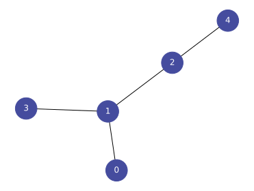

torch-ppr
=========

`torch-ppr` is a package to calculate (personalized) page ranks with PyTorch.

As a simple example, consider this simple graph with five nodes.

Its edge list is given as

.. code-block:: python

   edge_index = torch.as_tensor(data=[(0, 1), (1, 2), (1, 3), (2, 4)]).t()

We can use

.. code-block:: python

   >>> page_rank(edge_index=edge_index)
   tensor([0.1269, 0.3694, 0.2486, 0.1269, 0.1281])

to calculate the page rank, i.e., a measure of global importance.
We notice that the central node receives the largest importance score,
while all other nodes have equal importance.

We can also calculate *personalized* page rank which measures importance
from the perspective of a single node.
For instance, for node `2`, we have

.. code-block:: python

   >>> personalized_page_rank(edge_index=edge_index, indices=[2])
   tensor([[0.1103, 0.3484, 0.2922, 0.1103, 0.1388]])

By the virtue of using PyTorch, the code seamlessly works on GPUs, too, and
supports auto-grad differentiation. Moreover, the calculation of personalized
page rank supports automatic batch size optimization via
`torch_max_mem <https://github.com/mberr/torch-max-mem>`_.

Table of Contents
-----------------
.. toctree::
   :maxdepth: 2
   :caption: Getting Started
   :name: start

   installation
   usage
   details

Indices and Tables
------------------
* :ref:`genindex`
* :ref:`modindex`
* :ref:`search`
